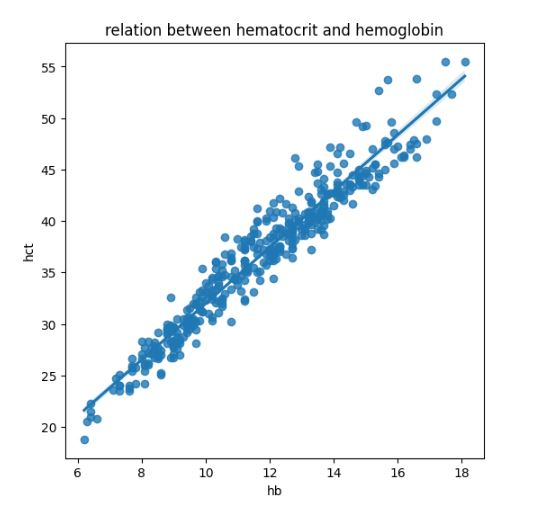
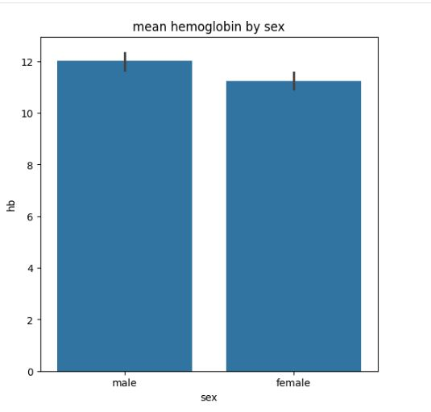
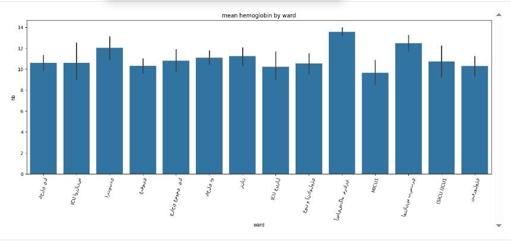
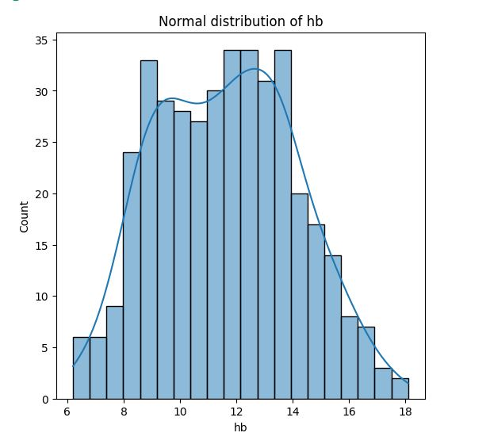
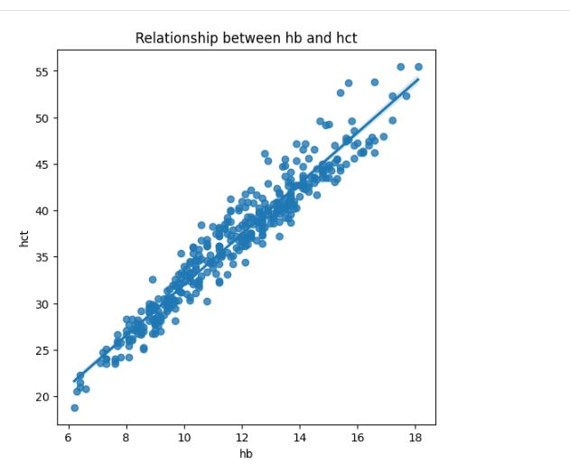

# تحلیل داده‌ی آزمایش خون (CBC)
## فايل اصلي داده به علت افشاي اطلاعات بيماران و حفظ حقوق منشور بيمار بارگزاري نميشود.
## سوال
آیا بین شاخص‌های خونی رابطه‌ی معناداری وجود دارد، و این شاخص‌ها چطور بر اساس 
جنسیت و بخش بیمارستانی متفاوت‌اند؟

## پاکسازی داده
داده‌ی خام شامل ستون‌های ناقص (تا ۹۸٪ مقدار گمشده در برخی آزمایش‌ها) و مقادیر 
نامعتبر (صفر) بود. پس از پاکسازی (حذف مقادیر گمشده، صفر، و پرت با روش IQR)، 
یک دیتاست تمیز با ۳۹۶ بیمار و ۶ شاخص خونی کامل به‌دست آمد.

## یافته‌ی کلیدی ۱ — رابطه‌ی هماتوکریت و هموگلوبین
همبستگی بسیار قوی (r = 0.97) بین این دو شاخص یافت شد که با دانش پزشکی 
(هر دو شاخص میزان گلبول قرمز خون را می‌سنجند) کاملاً هم‌خوان است.

## یافته‌ی کلیدی ۲ — تفاوت جنسیتی
میانگین هموگلوبین مردان (12.01) بالاتر از زنان (11.24) است، منطبق با 
محدوده‌های طبیعی شناخته‌شده‌ی پزشکی.

## تغييرات هموگلوبين در بخش هاي مختلف بيمارستان

## اعتبارسنجی آماری برای هموگلوبین

بررسی‌های آماری زیر برای اطمینان از صحت و معناداری یافته‌ها روی متغیر 
هموگلوبین (hb) انجام شد. کد کامل این بخش در فایل جداگانه‌ی `Normal distribution of hb.ipynb` قرار دارد.

### ۱. بررسی توزیع نرمال

بررسی توزیع با استفاده از میانگین ± ۱، ۲ و ۳ انحراف معیار انجام شد. نتایج 
نشان داد داده تقریباً از یک توزیع نرمال پیروی می‌کند:

- ۶۴.۶٪ داده در بازه‌ی میانگین ± ۱ انحراف معیار قرار دارد (مقدار نظری: ۶۸٪)
- ۹۶.۲٪ داده در بازه‌ی میانگین ± ۲ انحراف معیار قرار دارد (مقدار نظری: ۹۵٪)
- ۱۰۰٪ داده در بازه‌ی میانگین ± ۳ انحراف معیار قرار دارد (مقدار نظری: ۹۹.۷٪)

### ۲. تفاوت هموگلوبین بر اساس جنسیت

با استفاده از آزمون t (Independent t-test)، میانگین هموگلوبین بین مردان و 
زنان مقایسه شد:

- میانگین مردان: ۱۲.۰۱
- میانگین زنان: ۱۱.۲۴
p-value = 0.0018

چون p-value کوچک‌تر از ۰.۰۵ است، این تفاوت از نظر آماری **معنادار** است و 
با محدوده‌های طبیعی شناخته‌شده‌ی پزشکی هم‌خوانی دارد.

### ۳. رابطه‌ی هماتوکریت و هموگلوبین (رگرسیون خطی)

با استفاده از رگرسیون خطی، رابطه‌ی بین هماتوکریت (hct) و هموگلوبین (hb) 
بررسی شد:

- Slope (شیب): ۲.۷۳
- Intercept (عرض از مبدأ): ۴.۷۲
- R² (ضریب تعیین): ۰.۹۳۳
- p_value : 3.918337417801717e-233
- p-value ≈ ۰ (بی‌نهایت کوچک، رابطه از نظر آماری بسیار معنادار)

معادله‌ی خط: `hct = 2.73 × hb + 4.72`

۹۳.۳٪ از تغییرات هماتوکریت را می‌توان با هموگلوبین توضیح داد — رابطه‌ای 
بسیار قوی که با دانش پزشکی (هر دو شاخص میزان گلبول قرمز خون را می‌سنجند) 
کاملاً هم‌خوان است.
## ابزارها
- **Python** — زبان اصلی تحلیل
- **Pandas** — پاکسازی، تبدیل نوع داده، فیلتر کردن، گروه‌بندی
- **NumPy** — محاسبات عددی
- **Matplotlib / Seaborn** — مصورسازی (هیستوگرام، نمودار پراکندگی، رگرسیون)
- **SciPy (stats)** — آزمون فرضیه (t-test)، رگرسیون خطی، محاسبات آماری
- **روش IQR** — تشخیص و حذف داده‌های پرت (outlier)
