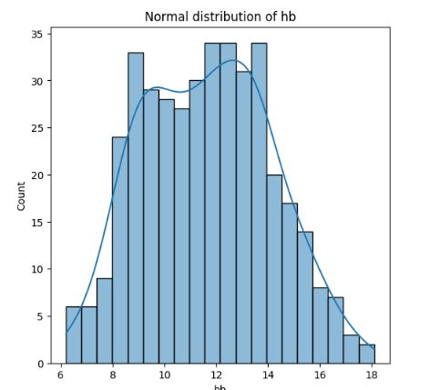

# تحلیل داده‌ی آزمایش خون (CBC)
## فايل اصلي داده به علت افشاي اطلاعات بيماران و حفظ حقوق منشور بيمار بارگزاري نميشود.
## سوال
آیا بین شاخص‌های خونی رابطه‌ی معناداری وجود دارد، و این شاخص‌ها چطور بر اساس 
جنسیت و بخش بیمارستانی متفاوت‌اند؟

## پاکسازی داده
داده‌ی خام شامل ستون‌های ناقص (تا ۹۸٪ مقدار گمشده در برخی آزمایش‌ها) و مقادیر 
نامعتبر (صفر) بود. پس از پاکسازی (حذف مقادیر گمشده، صفر، و پرت با روش IQR)، 
یک دیتاست تمیز با ۳۹۶ بیمار و ۶ شاخص خونی کامل به‌دست آمد.

## یافته‌ی کلیدی ۱ — رابطه‌ی هماتوکریت و هموگلوبین
همبستگی بسیار قوی (r = 0.97) بین این دو شاخص یافت شد که با دانش پزشکی 
(هر دو شاخص میزان گلبول قرمز خون را می‌سنجند) کاملاً هم‌خوان است.

## یافته‌ی کلیدی ۲ — تفاوت جنسیتی
میانگین هموگلوبین مردان (12.01) بالاتر از زنان (11.24) است، منطبق با 
محدوده‌های طبیعی شناخته‌شده‌ی پزشکی.

## تغييرات هموگلوبين در بخش هاي مختلف بيمارستان

## اعتبار سنجي آماري براي تست هموگلوبين انجام شد.
برسي توزيع نرمال ، میانگین ± ۱ انحراف معیار	میانگین،± ۲ انحراف معیار و	میانگین ± ۳ انحراف معیار انجام شد و فايل مربوطه تحت عنوان Normal distribution of hb.ipynb قرار داده شده است. 

## ابزارها
Python, Pandas, Seaborn, IQR-based outlier detection
